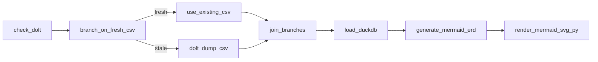

# Auto-Generated ERDs (via Airflow)

This folder contains **Entity-Relationship Diagrams (ERDs)** that are **auto-generated by Airflow** at the end of each ingestion DAG run. The diagrams are produced from the local DuckDB files created by the pipelines.

## What gets generated

For each repo/DAG we produce two files:

```
docs/
└─ erd/
   ├─ earnings/
   │  ├─ earnings.mmd     # Mermaid source (text)
   │  └─ earnings.svg     # Rendered diagram
   ├─ options/
   │  ├─ options.mmd
   │  └─ options.svg
   ├─ rates/
   │  ├─ rates.mmd
   │  └─ rates.svg
   └─ stocks/
      ├─ stocks.mmd
      └─ stocks.svg
```

- **`.mmd`** is the **Mermaid `erDiagram`** text (great to diff in Git and view on GitHub).
- **`.svg`** is rendered from the `.mmd` during the DAG run. If the renderer isn’t available, the DAG **still succeeds** and only the `.mmd` is written.

## How the diagrams are built (high level)

Each ingestion DAG (e.g., `ingest_dolt_stocks`, `ingest_dolt_rates`) runs this at the end:

1. **Introspect DuckDB** using `information_schema` to fetch tables, columns, PKs, and (if present) FKs.  
2. **Generate Mermaid** `erDiagram` text with safe identifiers (we auto-rename columns that start with digits, e.g. `1_month → c_1_month` so Mermaid won’t choke).
3. **Optional FK inference**: if explicit FKs aren’t declared, we infer edges where a table contains the full PK set of another (based on the DAG’s `PK_MAP`).
4. **Render to SVG** using the Python `mermaid_cli` package + Playwright (Chromium). If the renderer isn’t available, we skip this step and keep the `.mmd`.

## Example pipeline (stocks)


The **`generate_mermaid_erd`** task writes `docs/erd/<repo>/<repo>.mmd`.  
The **`render_mermaid_svg_py`** task renders `docs/erd/<repo>/<repo>.svg` (or logs a “skipped” message if the renderer isn’t available).

## Rendering prerequisites (only for the `.svg` step)

The `.mmd` file is always produced. To also get `.svg` on the Airflow box:

```bash
# in the same Python environment as the Airflow workers
pip install mermaid-cli playwright
python -m playwright install chromium
```

- First run may download a headless Chromium (~100MB). If that’s blocked, the SVG task will **skip**, leaving the `.mmd` (which is still useful and viewable on GitHub).
- **WSL tip:** install into your WSL environment; no Windows path tweaks needed.

## Common gotchas & how we handle them

- **Columns starting with digits** (`1_month`, `52_week_high`): Mermaid ERD requires attributes to start with a letter/underscore. We **auto-sanitize** to `c_1_month`, `c_52_week_high` and add a comment in the `.mmd` mapping original → safe.
- **No declared FKs:** You’ll still see relationships thanks to **PK-based inference** defined in each DAG’s `PK_MAP`.
- **Renderer missing:** You’ll see a log like “Skipped: mermaid-cli unavailable” — that’s fine; commit the `.mmd` and render locally if you want.

## Regenerating diagrams

- **Automatically:** every time the DAG runs successfully.
- **Manually via UI:** trigger the DAG in Airflow.
- **Manually via CLI:**
  ```bash
  airflow dags trigger ingest_dolt_stocks
  airflow dags trigger ingest_dolt_rates
  airflow dags trigger ingest_dolt_earnings
  airflow dags trigger ingest_dolt_options
  ```

## Adding ERDs to a new DAG (quick recipe)

1. Make sure the DAG writes to a DuckDB file (e.g., `data/processed/dolt/<repo>.duckdb`).
2. Add two tasks at the end:
   - `generate_mermaid_erd` → writes `docs/erd/<repo>/<repo>.mmd`
   - `render_mermaid_svg_py` → renders `docs/erd/<repo>/<repo>.svg` (skips if renderer not present)
3. Wire them after your `load_duckdb` task:
   ```
   load_duckdb >> generate_mermaid_erd >> render_mermaid_svg_py
   ```
4. (Optional but recommended) Define a `PK_MAP` for that DAG so inferred edges appear even without declared FKs.
