# Pipeline Flowcharts (Auto‑Generated by Airflow)

This folder contains **Mermaid flowcharts** of each data pipeline. The diagrams are **auto‑generated at the end of every DAG run** by tasks that introspect the *live* Airflow DAG object, so any change to task wiring is reflected on the next run.

- We always write a Mermaid source file: `<name>.mmd`.
- If the Mermaid renderer (Python `mermaid_cli` + Playwright/Chromium) is available, we also render `<name>.svg`; otherwise the SVG step is skipped and the DAG still succeeds.

## Previews

### Stocks


### Rates


### Options


### Earnings


### Price Minute


> Or, if your DAG outputs under `price_minute_alpaca/`:
>
> 

## How they’re produced (per DAG)

1. **Generate**: `generate_pipeline_mermaid` writes `docs/pipeline/<dag-name>/<dag-name>.mmd` by walking the DAG’s current tasks and dependencies (Branch tasks are drawn as diamonds).
2. **Render**: `render_pipeline_mermaid_svg` converts the `.mmd` to `.svg` using `mermaid_cli` + Playwright (Chromium).

### Rendering prerequisites (for the SVG step only)

```bash
pip install mermaid-cli playwright
python -m playwright install chromium
```

If that can’t run on the Airflow box, the SVG task will log a skip and the `.mmd` is still generated and committed.
