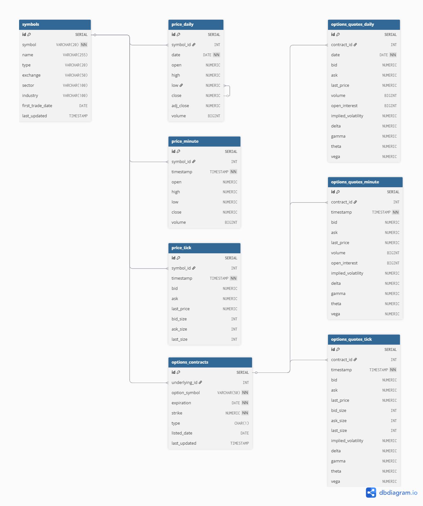

# QuantTrade Database Structure

This database schema is designed to store **market data** (equities, ETFs, crypto, options) at **multiple resolutions** (daily, minute, tick), along with **options chains, Greeks, and metadata** for backtesting, research, and live trading.

The setup uses a **hybrid storage model**:
- **Postgres (or TimescaleDB)** for structured data (daily, minute, options chains, portfolio results).
- **Parquet files** for heavy time-series (tick-level, large minute datasets) to optimize performance and storage.

---

## Schema Overview

### 1. Symbols Metadata

Master reference for all tradable instruments.

- **Table:** `symbols`
- **Key Columns:**
  - `symbol` (e.g., `AAPL`, `SPY`, `BTC-USD`)
  - `type` (`equity`, `etf`, `crypto`, `index`)
  - `exchange`, `sector`, `industry`
- Links all price and options tables via `symbol_id`.

---

### 2. Underlying Prices

Stored at three resolutions in separate tables:

- **`price_daily`**  
  - End-of-day OHLCV and adjusted close.
  - Optimized for long-term backtesting and analytics.

- **`price_minute`**  
  - One-minute bars for intraday research and trading models.

- **`price_tick`**  
  - Tick-level quotes (bid, ask, last) for execution models and event studies.

Each table references `symbols.symbol_id` as a foreign key.

---

### 3. Options Data

Split into **metadata** (contract details) and **quotes** (daily, minute, tick).

- **`options_contracts`**  
  - Static details for each option (symbol, expiration, strike, type).
  - Links to underlying via `underlying_id`.

- **Quotes Tables (Dynamic):**
  - `options_quotes_daily`
  - `options_quotes_minute`
  - `options_quotes_tick`

Each stores:
- Bid/ask, last price
- Volume, open interest
- Implied volatility and Greeks (`delta`, `gamma`, `theta`, `vega`)
- Linked to `options_contracts` via `contract_id`.

---

### 4. Backtest & Portfolio Results

Optional table for persisting results:
- **`backtest_results`**
  - Tracks performance metrics: `strategy_name`, `cagr`, `max_drawdown`, `sharpe`, `sortino`, `total_trades`.
  - Useful for dashboards and historical comparison.

---

## Naming Conventions

- **Prefixes:**
  - `price_*` → Underlying asset prices (daily/minute/tick).
  - `options_contracts` → Option contract metadata.
  - `options_quotes_*` → Option quotes by timeframe.

- **Timeframes:**
  - `_daily` → End-of-day (compact, indexed).
  - `_minute` → 1-minute bars.
  - `_tick` → Tick-level (often stored in Parquet).

- **Keys:**
  - Use `symbol_id` (from `symbols`) for all price data.
  - Use `contract_id` (from `options_contracts`) for all option quotes.

---

## Storage Recommendations

1. **Daily & Minute Data**  
   - Store in Postgres or TimescaleDB for fast joins and queries.

2. **Tick Data**  
   - Store in Parquet (`data/price/tick` and `data/options/tick`) for scalable analytics.
   - Keep only summaries (OHLCV, VWAP) in SQL for quick lookups.

3. **Partitioning**  
   - Use `PARTITION BY RANGE (date)` for large Postgres tables.
   - Or use **TimescaleDB hypertables** for automatic time-series partitioning.

---

## ERD

  

